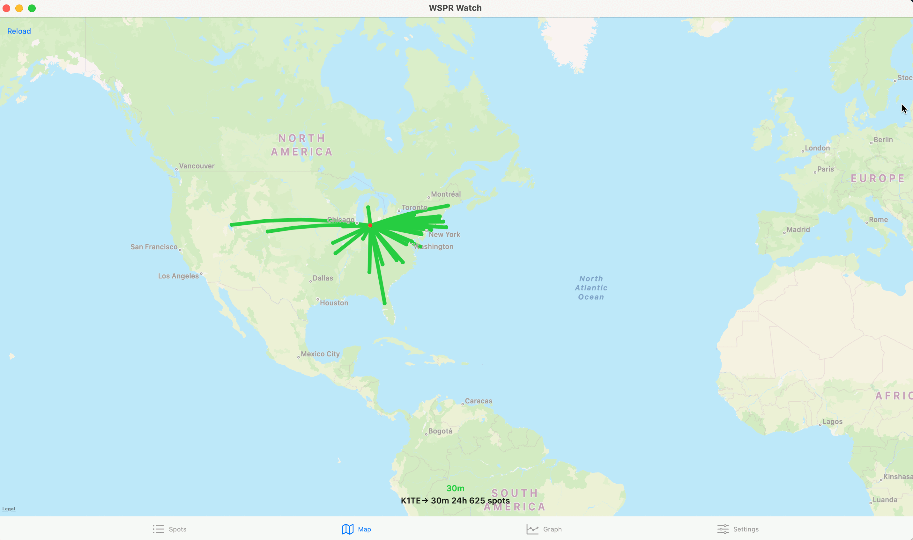

### Easy-ESP8266-GPS-NTP-Server (GPS NTP Server and Client)

Stratum 1 NTP Server based on WeMos D1 Mini board (ESP8266 processor) and a
u-blox NEO-6M (or better) GPS Module.

Note: We need a GPS module which supports `ZDA NMEA` messages to be enabled.

Our NTP (network time protocol) server does not require a hotspot, or internet
service provider.

[What is Stratum 1?](https://endruntechnologies.com/products/ntp-time-servers/stratum1)

The repository is part of the `Easy Beacons STEM` collection for the WB2TEV
radio club.

Other projects in the `Easy Beacons STEM` collection:

- https://github.com/kholia/Easy-Beacons-STEM
- https://github.com/kholia/Easy-Digital-Beacons-v1
- https://github.com/kholia/ConsensusBasedTimeSync

This projects builds fine with `Arduino IDE 1.8.19` as well as `Arduino IDE
2.x`.


#### Backstory

We need to be able to have time synchronization to about +/- 2 seconds to use
the WSPR weak signal propagation reporting software from K1JT called WSJT-X.

One hundred and fifty years ago, this 18 November 2023, time standardization
became important in America, before then, every town had a clock in the center
of town and no two towns were on the same time.  Railroads made time critical so
that there would not be two railroad trains hurtling toward each other on the
same track unaware of when the other was in time on the track.  This article
from Smithsonian magazine explains the need for measuring and agreeing on time
on a local, world and planetary scale.

https://www.smithsonianmag.com/smithsonian-institution/how-standardization-time-changed-american-society-180961503/

We are utilizing our Buzzards Bay Radio Club - WB2TEV STEM School's generous
grant from the ARRL this summer to build this `Stratum 1 NTP Server`.

Please feel free to inquire abput this work at NTP@piRshared.org, or at the
website of the WB2TEV Buzzards Bay Radio club (which is an hour south of Boston
Massachusetts, USA).

- K1TE, Bradshaw 7/4/2023


#### How it works?

The $3 ESP8266 and a $4 u-blox NEO-6M GPS module combination (both from
Amazon) receives the GPS satellite time, set by atomic clock detailed in this
Wikipedia article - https://en.wikipedia.org/wiki/Atomic_clock. The ESP8266
operates as its own WiFi source so that one or more computers, or our STEM
Radio WSPR Beacons may synchronize time to the satellites and the world-wide
WSPR WSJT-X receivers. All of the transmissions and receivers expect a +/- 2
second accuracy to the even minute of the hour.

Our repository has code that brings up an NTP server on a WiFi access point.
Various NTP clients can then fetch, utilize, and display the time from the GPS
module by talking to this NTP server over WiFi.


#### Connections

WeMos D1 Mini

```
D7 (GPIO13, RX) -> Connect to GPS' TX

D8 (GPIO15, TX) -> Connect to GPS' RX

D6 -> PPS_PIN
```


#### Building the project

Run the follwing commands:

```
pip3 install esptool pyserial

make install_arduino_cli

make install_platform

make deps
```

```
make compile

make upload
```


#### Usage (from Linux clients)

```
sudo apt-get install sntp ntpdate moreutils -y
```

```
sudo ntpdate -s 192.168.4.1
```


#### Debugging Tips

```
$ ntpdate -d 192.168.4.1
12 Jul 20:57:05 ntpdate[359337]: ntpdate 4.2.8p15@1.3728-o Wed Feb 16 17:13:02 UTC 2022 (1)
Looking for host 192.168.4.1 and service ntp
host found : 192.168.4.1
transmit(192.168.4.1)
receive(192.168.4.1)
transmit(192.168.4.1)
receive(192.168.4.1)
transmit(192.168.4.1)
receive(192.168.4.1)
transmit(192.168.4.1)
receive(192.168.4.1)

server 192.168.4.1, port 123
stratum 1, precision -26, leap 00, trust 000
refid [PPS], root delay 0.000000, root dispersion 0.000000
reference time:      e85944cd.00000000  Wed, Jul 12 2023 20:57:09.000
originate timestamp: e85944d0.73c322df  Wed, Jul 12 2023 20:57:12.452
transmit timestamp:  e85944d0.6b1e74fe  Wed, Jul 12 2023 20:57:12.418
filter delay:  0.03259    0.05696    0.07130    0.05872
               ----       ----       ----       ----
filter offset: +0.005727  +0.018006  +0.024707  +0.017104
               ----       ----       ----       ----
delay 0.03259, dispersion 0.01134, offset +0.005727

12 Jul 20:57:12 ntpdate[359337]: adjust time server 192.168.4.1 offset +0.005727 sec
```

```
$ ./testset.sh
Jul 12 21:25:53 2023-07-12 21:25:53.255770 (-0530) +0.016032 +/- 0.010703 192.168.4.1 s1 no-leap
Jul 12 21:25:58 2023-07-12 21:25:58.268657 (-0530) -0.000487 +/- 0.000340 192.168.4.1 s1 no-leap
Jul 12 21:26:03 2023-07-12 21:26:03.382285 (-0530) +0.033582 +/- 0.022403 192.168.4.1 s1 no-leap
Jul 12 21:26:08 2023-07-12 21:26:08.484328 (-0530) +0.040685 +/- 0.027138 192.168.4.1 s1 no-leap
Jul 12 21:26:13 2023-07-12 21:26:13.569016 (-0530) +0.032620 +/- 0.021762 192.168.4.1 s1 no-leap
Jul 12 21:26:18 2023-07-12 21:26:18.586304 (-0530) -0.004933 +/- 0.003303 192.168.4.1 s1 no-leap
```


#### Fun




#### Mods

The cheap versions of NEO-XYZ GPS Module do NOT expose a PPS PIN in a
convenient manner.

You can tap the PPS output signal by soldering a jumper cable to the SMD
resistor near the PPS LED on the NEO-XYZ GPS Module. Please ensure sufficient
strain relief for this tapped connection.

You can also buy better u-blox GPS modules which expose the PPS pin directly.


#### References

- https://robu.in/product/ublox-neo-6m-gps-module/
- [GT-U7 GPS module - Find on Amazon USA](https://www.amazon.com/dp/B0B31NRSD2) - This also supports `GPZDA` messages like the NEO-6M GPS module
- [WeMos D1 Mini](https://robu.in/product/d1-mini-v2-nodemcu-4m-bytes-lua-wifi-internet-of-things-development-board-based-esp8266/)
- https://github.com/ddrown/esp8266gps
